# Qwen3-Omni on vLLM-Omni: Performance Optimizations
## Summary

Qwen3-Omni is a native multimodal model that can understand **text, audio, image, and video** inputs, and generate both **text** and **speech** outputs. In production serving, this architecture is naturally split into three stages:

- **Thinker**: multimodal understanding and text generation
- **Talker (+ Talker-MTP / code predictor path)**: converts semantic/text representations into codec tokens
- **Code2Wav**: decodes codec tokens into waveform audio

vLLM-Omni now supports running this full Qwen3-Omni pipeline end-to-end, and more importantly, supports stacking multiple latency/throughput optimizations that work together:

1. **Batching** improves GPU utilization stage by stage and increases overall throughput.
2. **CUDA Graph** reduces CPU launch overhead and decode-time jitter on stable shapes.
3. **Async chunk** overlaps compute and communication across stages, improving both TTFP and E2E.

Compared with **Hugging Face Transformers** (offline, single request), vLLM-Omni with streaming and the full optimization stack (Batching + CUDA Graph + Async Chunk) delivers much lower latency and higher efficiency:

<table><tr>
<td>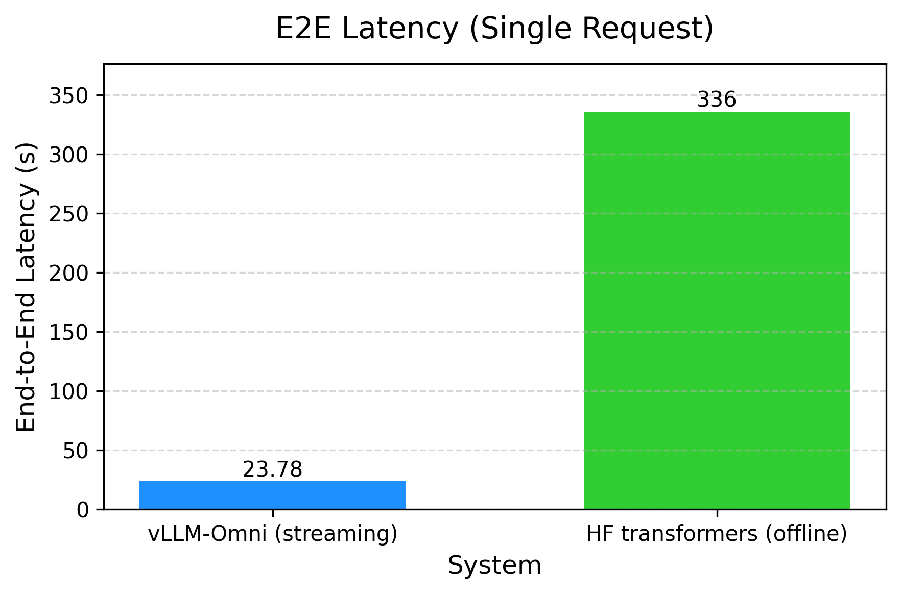</td>
<td>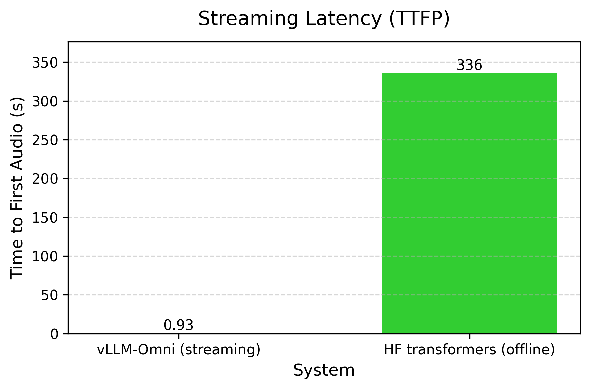</td>
<td>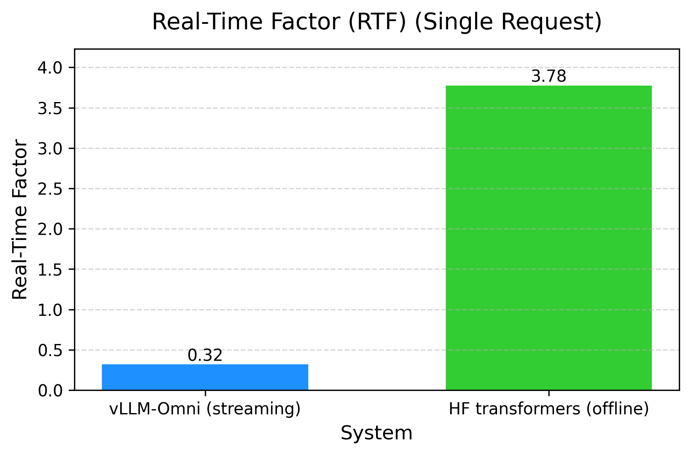</td>
</tr></table>

- **E2E latency**: 23.78 s (vLLM-Omni) vs 336.10 s (transformers) — **~93%** reduction
- **Time to first audio (TTFP)**: 0.934 s vs 336.10 s — **~99.7%** reduction
- **Real-time factor (RTF)**: 0.32 vs 3.776 — **~91%** reduction (~12× faster)

Compared with the baseline (vLLM-Omni without these optimizations), the stacked setup (Batching + CUDA Graph + Async Chunk) achieves:

- **E2E latency (E2EL) reduction**: **~94%** at concurrency 10 (302,722 ms → 17,408 ms); **~77%** at concurrency 1 (37,300 ms → 8,667 ms)
- **Audio TTFP reduction**: **~99%** at concurrency 10 (302,595 ms → 2,157 ms); **~98%** at concurrency 1 (37,174 ms → 795 ms)
- **Real-time factor (RTF)**: **~95%** reduction at concurrency 10 (11.72 → 0.64), i.e. **~18×** higher effective throughput

*Final = Batching + CUDA Graph + Async Chunk.*

This post walks through each optimization in the same order they are typically enabled in practice, then ends with a deployment playbook you can directly apply.

---

## Pipeline Batching Across Three Stages

### How stage-wise batching works

For Qwen3-Omni, batching is not a single switch at one model boundary. It is a pipeline-level optimization:

- requests are grouped per stage using `runtime.max_batch_size`
- each stage executes batch inference with its own scheduler/worker
- stage outputs are routed to downstream stages with per-request mapping preserved

This is especially important for multimodal speech generation, where bottlenecks may move between Thinker, Talker, and Code2Wav depending on concurrency and output length.

### Stage-level batching results (Baseline vs. Batch)

Batching alone greatly reduces E2EL and RTF at higher concurrency (e.g. at concurrency 10, E2EL drops from ~303s to ~45s).

<table><tr>
<td>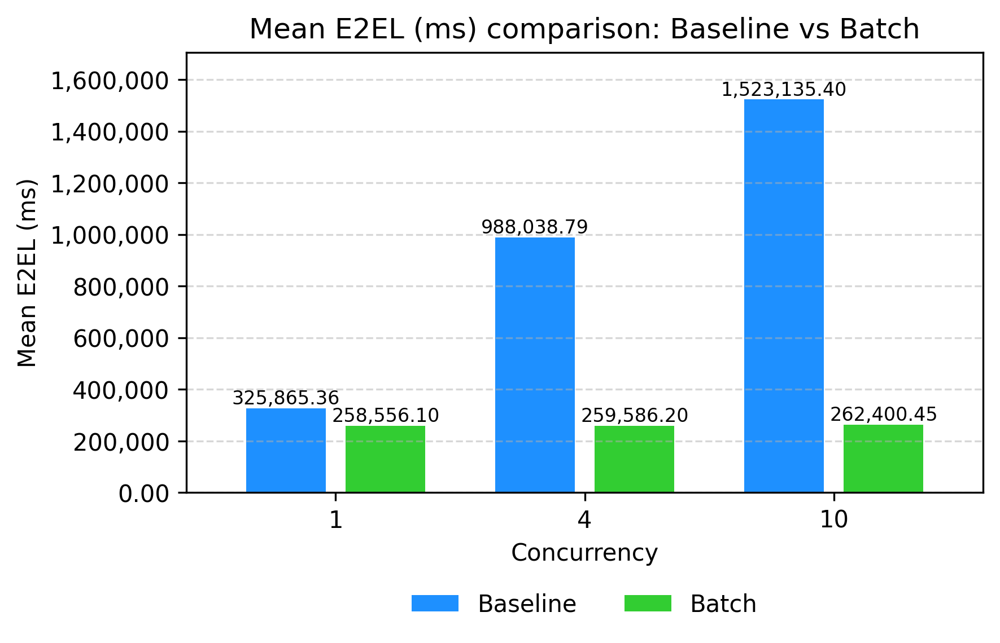</td>
<td>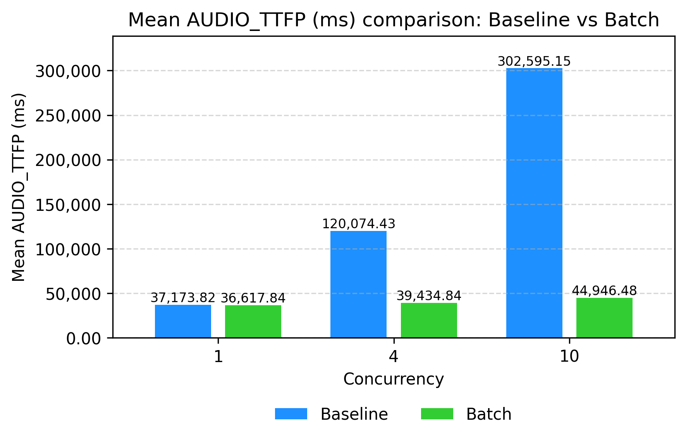</td>
<td>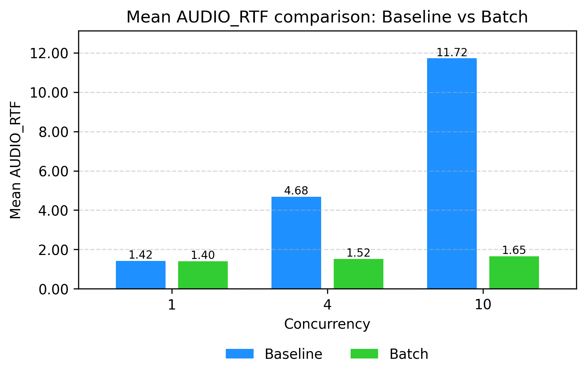</td>
</tr></table>

---

## CUDA Graph on the Critical Decode Path

### Why CUDA Graph helps here

In decode-heavy serving, repeatedly launching many small kernels from CPU can become a visible overhead. CUDA Graph reduces this overhead by capturing and replaying stable execution graphs.
In stage configs, this is typically represented by `enforce_eager: false` for stages where graph capture is desired (commonly Thinker/Talker), while Code2Wav may keep eager mode depending on stage behavior.

### CUDA Graph results on top of batching

Adding CUDA Graph on the decode path further cuts E2EL and TTFP (e.g. at concurrency 1, E2EL drops from ~37s to ~10s) and lowers RTF.

<table><tr>
<td>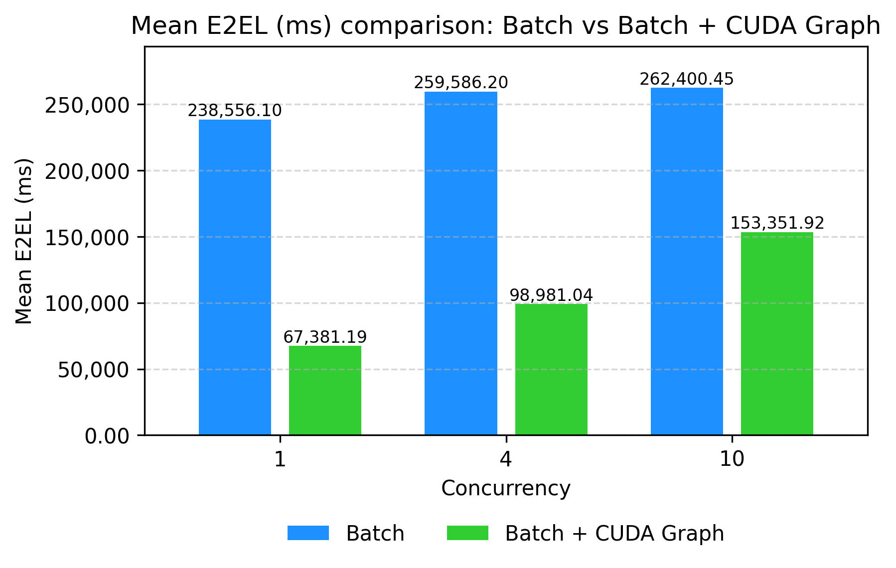</td>
<td>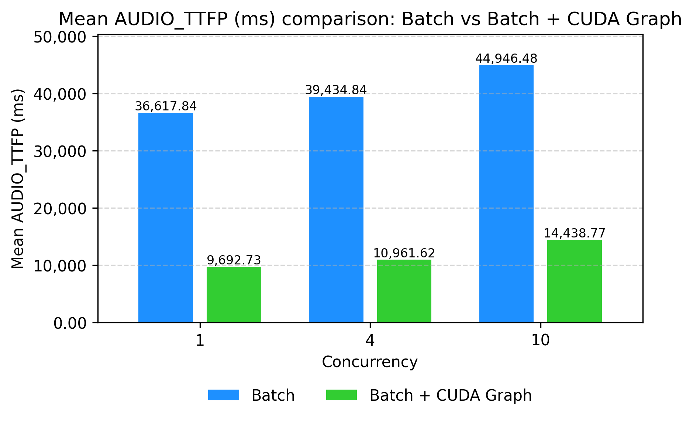</td>
<td>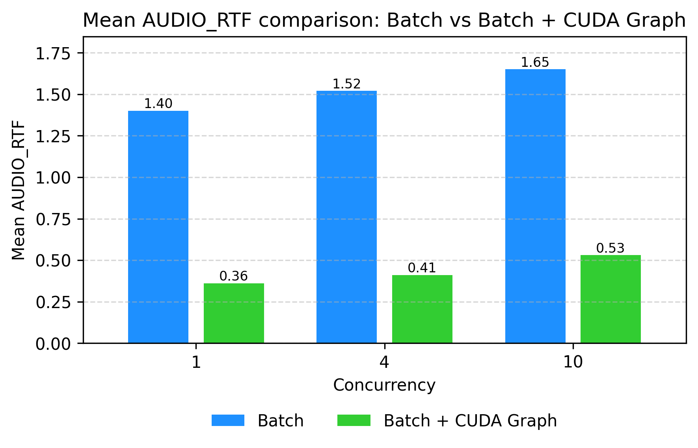</td>
</tr></table>

---

## Streaming + Async Chunk: Earlier Audio and Cross-Stage Overlap

### Why this step matters for first-packet latency

Two mechanisms work together to improve user-visible latency:

- **Streaming output**: **audio streaming** emits audio chunks as soon as they are decoded (lower **TTFP**). Without streaming, the client waits for larger buffers or end-of-sequence.
- **Async chunk** is the main enabler for *earlier* audio: instead of handing off whole-request results between stages, each stage forwards **chunks** so the next stage can start as soon as the first chunk is ready. Thinker → Talker forwards hidden-state chunks; Talker → Code2Wav forwards codec chunks; Code2Wav decodes and emits packets incrementally. This **overlaps compute and communication** across stages and directly reduces time-to-first-audio-packet (TTFP) and end-to-end latency (E2EL).

So in practice: streaming defines *how* bytes are sent to the client; async chunk defines *when* the pipeline can produce the first bytes. Enabling **async chunk on top of batching + CUDA Graph** gives the largest gain for TTFP and E2EL in our benchmarks.

### Results: Batch + CUDA Graph vs. Batch + CUDA Graph + Async Chunk

Stacking assumptions: batching and CUDA Graph enabled; streaming input/output enabled. The figures below compare **without** vs **with** async chunk. Async chunk brings **TTFP down sharply** (e.g. at concurrency 1: 9,693 ms → 795 ms, **~92% reduction**), so users hear the first audio much sooner. E2EL at concurrency 1 also improves (9,817 ms → 8,667 ms). At higher concurrency, E2EL/RTF may trade off slightly for better first-packet latency; the stacked setup still dominates the baseline.

<table><tr>
<td>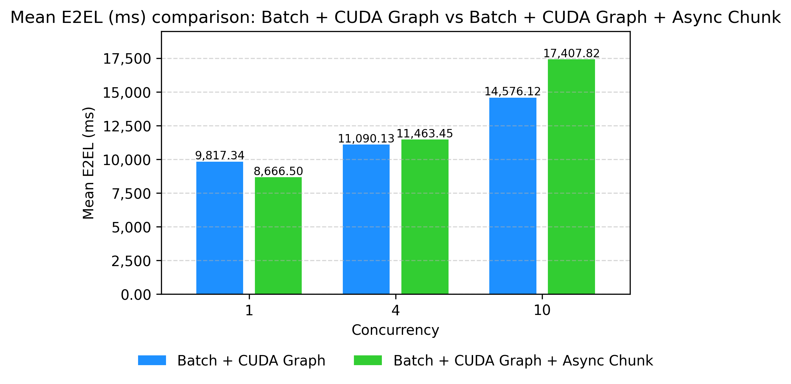</td>
<td>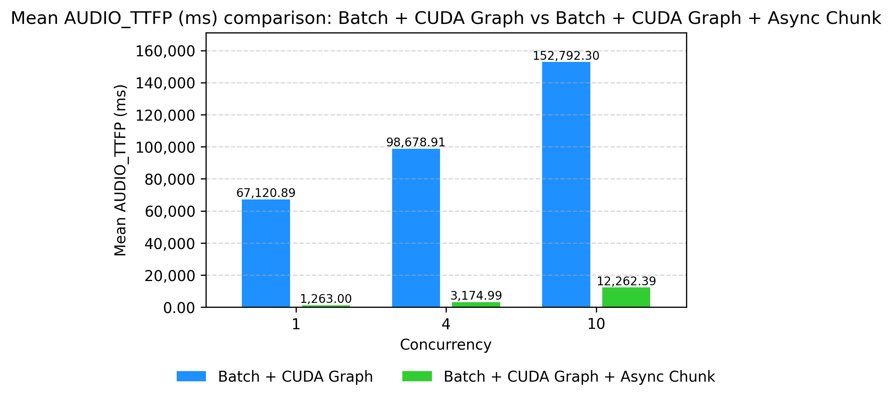</td>
<td>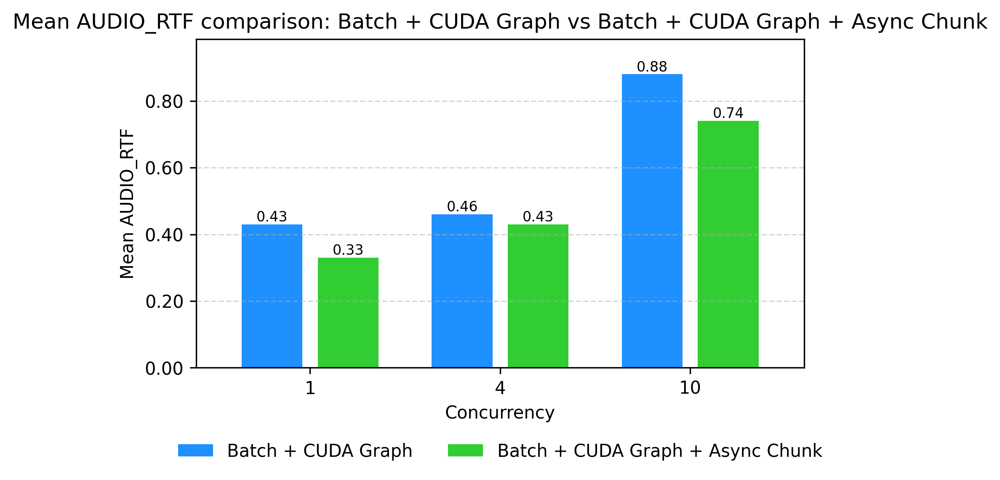</td>
</tr></table>

---

## Deployment Playbook: Enabling Qwen3-Omni Optimizations in vLLM-Omni

### 1) Serve Qwen3-Omni with the default 3-stage config

```bash
vllm serve Qwen/Qwen3-Omni-30B-A3B-Instruct \
  --omni \
  --port 8091 \
  --stage-configs-path vllm_omni/model_executor/stage_configs/qwen3_omni_moe.yaml
```

Notes:

- `runtime.max_batch_size` controls stage-level batching.
- Thinker/Talker commonly use `enforce_eager: false` for CUDA Graph paths.
- Code2Wav often remains eager (`enforce_eager: true`) depending on runtime behavior.

### 2) Enable async chunk

```bash
vllm serve Qwen/Qwen3-Omni-30B-A3B-Instruct \
  --omni \
  --port 8091 \
  --stage-configs-path vllm_omni/model_executor/stage_configs/qwen3_omni_moe_async_chunk.yaml
```

The async chunk config enables:

- top-level `async_chunk: true`
- async stage handoff processors (`thinker2talker_async_chunk`, `talker2code2wav_async_chunk`)

### 3) Key config knobs (quick reference)

```yaml
async_chunk: true
stage_args:
  - stage_id: 0 # thinker
    runtime:
      max_batch_size: 64
    engine_args:
      enforce_eager: false
      max_num_batched_tokens: 32768
      custom_process_next_stage_input_func: vllm_omni.model_executor.stage_input_processors.qwen3_omni.thinker2talker_async_chunk

  - stage_id: 1 # talker
    runtime:
      max_batch_size: 64
    engine_args:
      enforce_eager: false
      max_num_batched_tokens: 32768
      custom_process_next_stage_input_func: vllm_omni.model_executor.stage_input_processors.qwen3_omni.talker2code2wav_async_chunk

  - stage_id: 2 # code2wav
    runtime:
      max_batch_size: 64
    engine_args:
      enforce_eager: true
      max_num_batched_tokens: 51200 # tune this for throughput vs first-packet tradeoff
```
---
